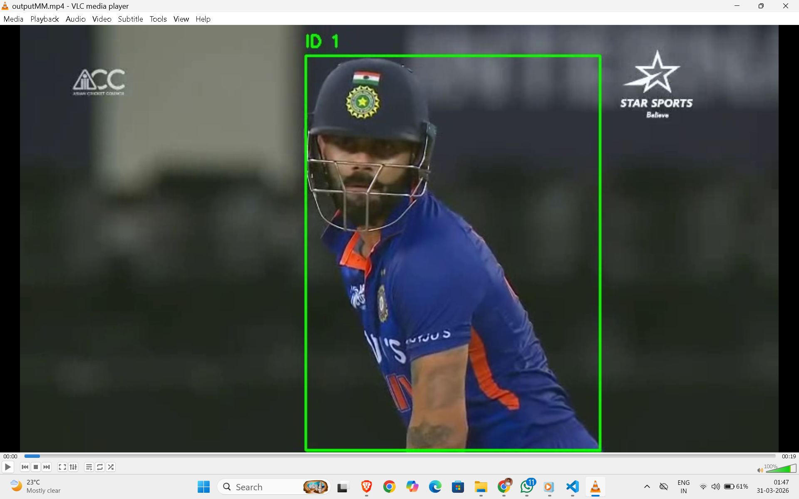
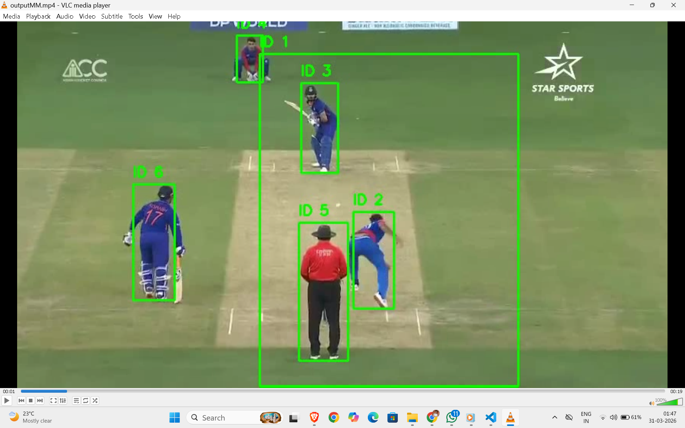
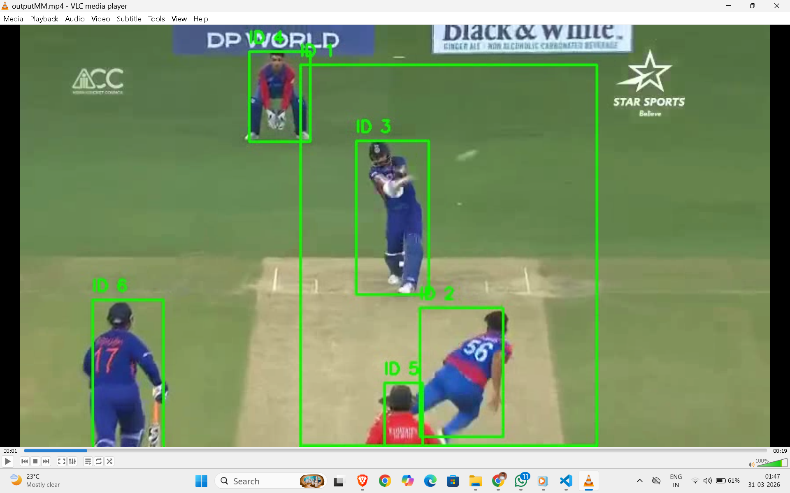

# Multi-Object Detection and Tracking using YOLOv8 and DeepSORT

---

## Project Overview

This project implements a complete computer vision pipeline for detecting and tracking multiple objects in a video using YOLOv8 (Ultralytics) for object detection and DeepSORT for tracking.

The system assigns unique and persistent IDs to each detected object and maintains identity consistency across frames, even in challenging scenarios such as occlusion, motion blur, and overlapping objects.

---

## Objectives

- Detect all relevant objects in a video
- Assign unique IDs to each object
- Maintain consistent tracking across frames
- Handle real-world challenges such as occlusion, motion, and scale variation

---

## Methodology

### Object Detection

- Model: YOLOv8 (Ultralytics)
- Detects objects in each frame with bounding boxes and confidence scores

### Object Tracking

- Algorithm: DeepSORT
- Key Components:
  - Kalman Filter for motion prediction
  - Hungarian Algorithm for data association
  - Appearance feature matching for identity preservation

---

## Pipeline Flow

1. Read input video frame-by-frame
2. Perform object detection using YOLOv8
3. Extract bounding boxes and confidence scores
4. Pass detections to DeepSORT tracker
5. Assign unique IDs to each object
6. Draw bounding boxes and IDs on frames
7. Generate annotated output video

---

## Input and Output

### Original Input Video

https://drive.google.com/file/d/1S1KHHHOjUHi4T2Cho_0QdY4get0FEeo_/view?usp=drivesdk

### Output Video (Tracked)

https://drive.google.com/file/d/1IVT4KVAavtyDxayDyr2ukiF_qxJ_EzV-/view?usp=drivesdk

### Demo Explanation Video

https://drive.google.com/file/d/1m7Z5C068KfvMYyYCc48FzXvTtSDffyf5/view?usp=drivesdk

---

## Results

The system successfully demonstrates the following capabilities:

- Detects multiple objects in real-time  
- Assigns unique IDs to each object  
- Maintains identity across frames  
- Handles moderate occlusion and motion

## Sample Outputs

  
  

---

## Technology Stack

- Python
- OpenCV
- YOLOv8 (Ultralytics)
- DeepSORT
- NumPy

---

## Installation and Setup

### Prerequisites

- Python 3.8 or higher
- pip
- Git

### Clone Repository

git clone https://github.com/Bhoopendrapatel/multi-object-tracking-yolo-deepsort.git
cd multi-object-tracking-yolo-deepsort

### Install Dependencies

pip install -r requirements.txt

### How to Run

python assignment.py

---

## Challenges Faced

- Maintaining ID consistency during occlusion
- Handling fast-moving objects
- Managing overlapping detections
- Balancing accuracy and performance

---

## Limitations

- ID switching may occur in heavy occlusion
- Performance depends on hardware
- Detection accuracy depends on model quality

---

## Future Improvements

- Trajectory visualization
- Object counting system
- Heatmap generation
- Speed estimation
- Improved detection models

---

## Report

[Download Report](./report.pdf)

---
